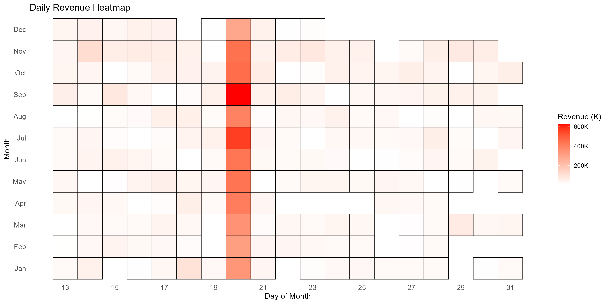
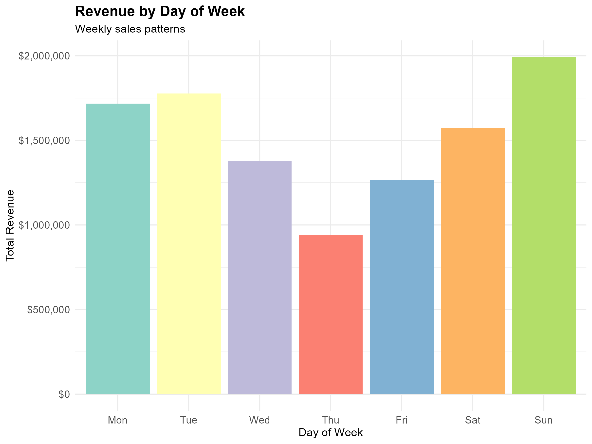
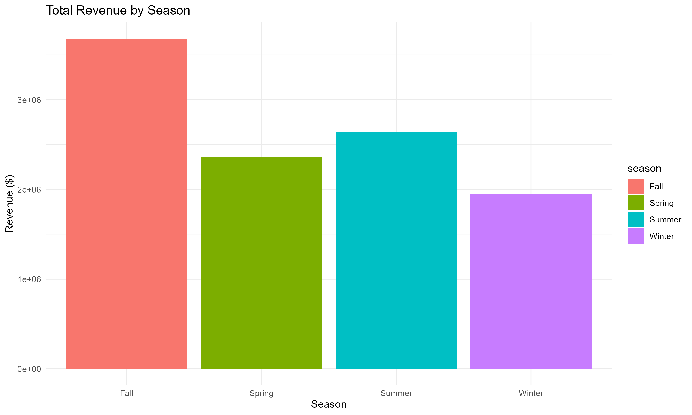
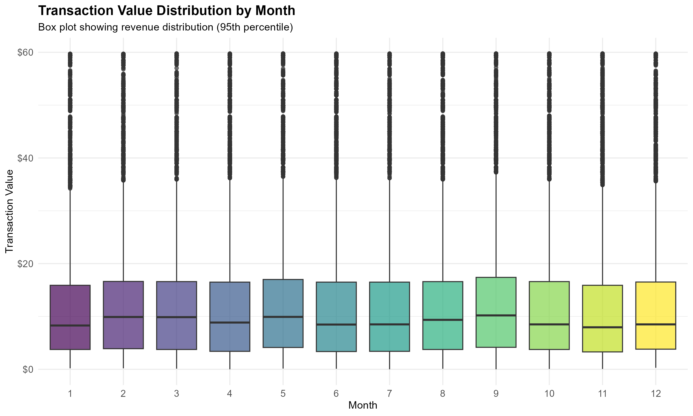
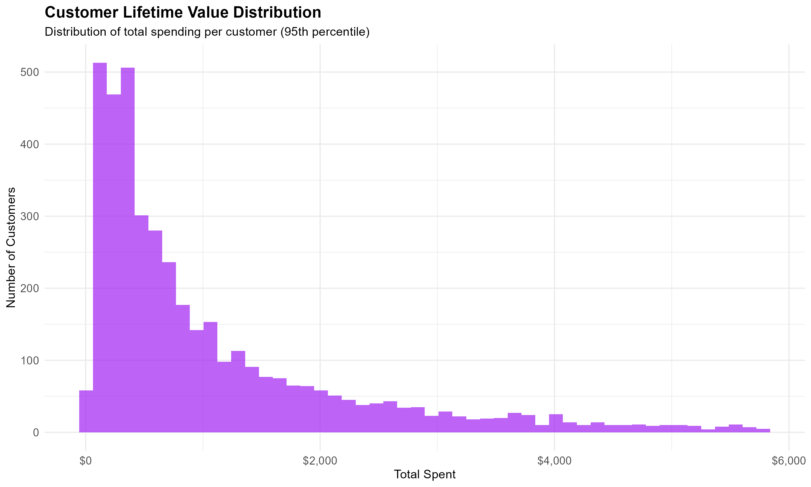
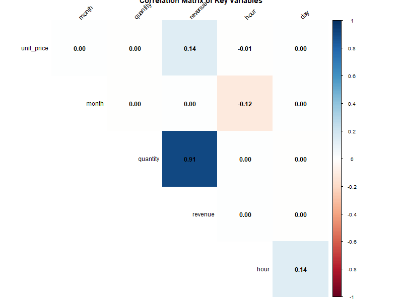

<a id="readme-top"></a>

<div align="center">

# E-Commerce Customer Behavior Analysis

An end-to-end exploratory data analysis of 524,878 e-commerce transactions using R.

[](https://www.r-project.org/)
[](LICENSE)

[View Report](report/EDA_report.html) · [Explore Outputs](outputs) · [Repository](https://github.com/Shenone77/Customer_Behavior_Analysis)

</div>

## About The Project

This project turns raw retail transaction data into a cleaned dataset, reusable summary tables, business metrics, visualizations, and an HTML report. The analysis focuses on revenue trends, customer value, product performance, geography, purchase timing, and seasonality.

### Key Results

| Metric | Result |
|---|---:|
| Cleaned transactions | 524,878 |
| Total revenue | $10,642,111 |
| Unique customers | 4,339 |
| Unique products | 3,922 |
| Average transaction value | $20.28 |
| Largest market | United Kingdom ($9.00M) |
| Highest-revenue season | Fall ($3.68M) |

The VIP segment contains 434 customers and contributes approximately $7.21M in revenue. The highest-revenue item in the generated product table is `DOTCOM POSTAGE`, followed by `REGENCY CAKESTAND 3 TIER`.

### Built With

- [R](https://www.r-project.org/)
- `tidyverse`, `janitor`, `lubridate`, and `skimr` for loading, cleaning, and analysis
- `ggplot2`, `viridis`, `scales`, `corrplot`, and `GGally` for visualization
- `rmarkdown`, `knitr`, `DT`, and `plotly` for reporting

## Analysis Gallery

### Revenue Patterns

| Daily revenue intensity | Weekly revenue pattern |
|---|---|
|  |  |

| Seasonal revenue | Transaction value by month |
|---|---|
|  |  |

### Customers And Products

| Customer purchase frequency | Customer value distribution |
|---|---|
|  |  |

| Top products by revenue | Hourly sales pattern |
|---|---|
|  |  |

### Geographic And Variable Relationships

| Top countries by revenue | Correlation heatmap |
|---|---|
|  |  |

## Project Structure

```text
DataAnalysis_R/
|-- data/                    # Raw and cleaned CSV/RDS datasets
|-- outputs/
|   |-- plots/               # Generated charts
|   |-- summary_reports/     # Text summaries
|   `-- tables/              # Analysis tables
|-- report/
|   |-- EDA_report.Rmd       # Report source
|   `-- EDA_report.html      # Rendered report
|-- scripts/
|   |-- 01_data_loading.R
|   |-- 02_data_cleaning.R
|   |-- 03_exploratory_analysis.R
|   `-- 04_visualizations.R
`-- ecommerce_customer_behavior_eda.Rproj
```

## Getting Started

### Prerequisites

Install [R](https://cran.r-project.org/) and optionally [RStudio](https://posit.co/download/rstudio-desktop/). Then install the required packages:

```r
install.packages(c(
  "tidyverse", "skimr", "janitor", "lubridate", "viridis",
  "scales", "corrplot", "GGally", "rmarkdown", "knitr", "DT", "plotly"
))
```

### Run The Analysis

```powershell
git clone https://github.com/Shenone77/Customer_Behavior_Analysis.git
cd Customer_Behavior_Analysis
Rscript scripts/01_data_loading.R
Rscript scripts/02_data_cleaning.R
Rscript scripts/03_exploratory_analysis.R
Rscript scripts/04_visualizations.R
Rscript -e "rmarkdown::render('report/EDA_report.Rmd')"
```

Run the scripts from the repository root and in numerical order because each stage reads artifacts produced by the previous stage.

## Data Pipeline

1. Load the transaction dataset and generate an initial quality report.
2. Standardize columns and data types, derive date and revenue features, remove returns and invalid prices, flag outliers, and deduplicate rows.
3. Calculate revenue, product, customer segment, country, seasonal, and time-based summaries.
4. Generate eleven visualization artifacts and render the final HTML report.

## License

Distributed under the terms in [LICENSE](LICENSE).

## Acknowledgments

- README structure adapted from [othneildrew/Best-README-Template](https://github.com/othneildrew/Best-README-Template).
- Badges provided by [Shields.io](https://shields.io/).

<p align="right"><a href="#readme-top">Back to top</a></p>
