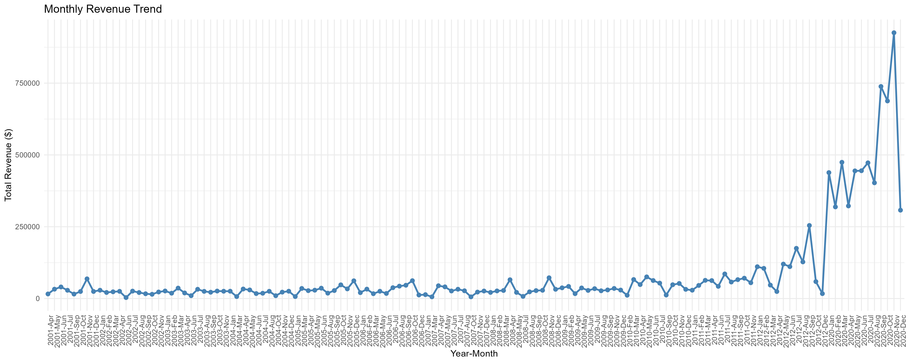
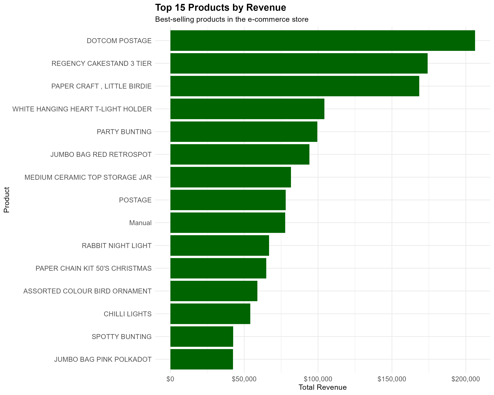
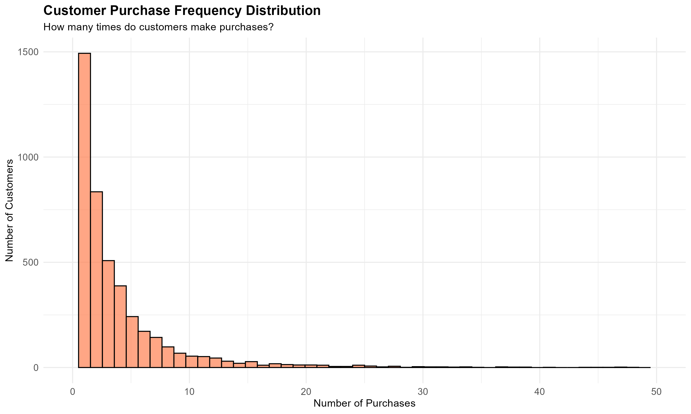
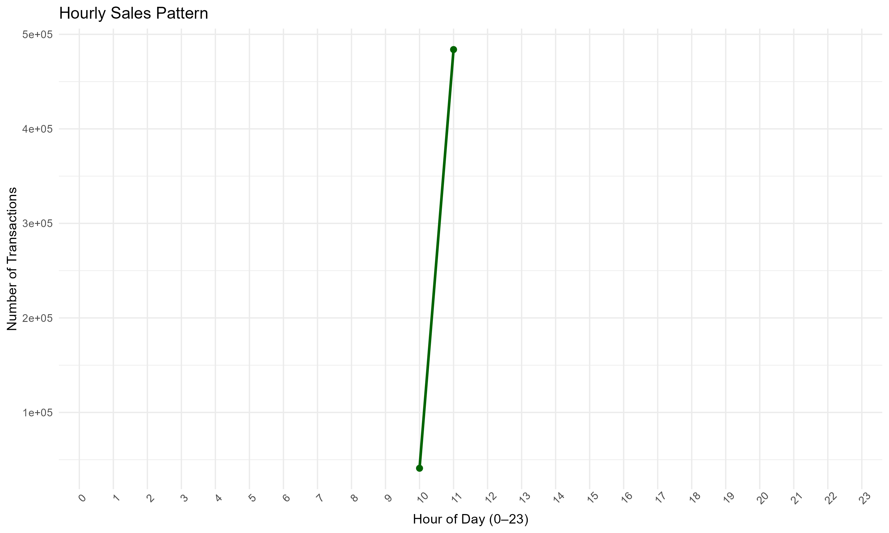
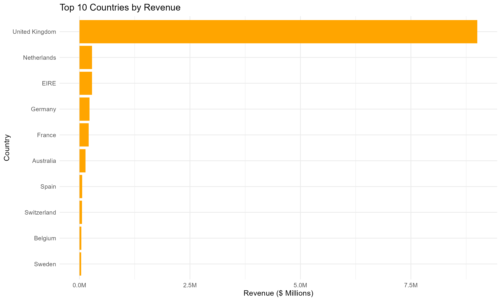

```{r setup, include=FALSE}
knitr::opts_chunk$set(echo = FALSE, warning = FALSE, message = FALSE)

library(tidyverse)
library(knitr)
library(DT)
library(plotly)

# Load data
ecommerce_clean <- readRDS("../data/cleaned_data.rds")
monthly_revenue <- read_csv("../outputs/tables/monthly_revenue.csv")
top_products <- read_csv("../outputs/tables/top_products_by_revenue.csv")
customer_segments <- read_csv("../outputs/tables/customer_segments.csv")
country_summary <- read_csv("../outputs/tables/country_summary.csv")
seasonal_summary <- read_csv("../outputs/tables/seasonal_summary.csv")
```

# 1. Executive Summary

This report presents a comprehensive analysis of e-commerce customer behavior.

**Total Revenue:** $`r format(sum(ecommerce_clean$revenue), big.mark=",", nsmall=2)`

**Unique Customers:** `r format(n_distinct(ecommerce_clean$customer_id), big.mark=",")`

**Unique Products:** `r format(n_distinct(ecommerce_clean$stock_code), big.mark=",")`

**Date Range:** `r paste(min(as.Date(ecommerce_clean$invoice_date)), "to", max(as.Date(ecommerce_clean$invoice_date)))`

---

# 2. Data Overview

Key metrics extracted from the processed dataset.

```{r}
data_summary <- data.frame(
  Metric = c("Total Transactions", "Average Order Value", "Total Countries"),
  Value = c(
    format(nrow(ecommerce_clean), big.mark = ","),
    paste("$", round(mean(ecommerce_clean$revenue), 2)),
    format(n_distinct(ecommerce_clean$country), big.mark = ",")
  )
)

kable(data_summary, caption = "Key Dataset Metrics")
```

---

# 3. Revenue Analysis

## 3.1 Monthly Revenue Trend

```{r}

```

## 3.2 Daily Revenue Heatmap

```{r}
knitr::include_graphics("../outputs/plots/daily_revenue_heatmap.png")
```

---

# 4. Product Performance

## 4.1 Top 10 Products by Revenue

```{r}
top_products %>%
  head(10) %>%
  mutate(total_revenue = round(total_revenue, 2)) %>%
  select(stock_code, description, total_quantity, total_revenue) %>%
  datatable(
    caption = "Top 10 Products by Revenue",
    colnames = c("Stock Code", "Description", "Quantity Sold", "Revenue ($)")
  )
```

## 4.2 Revenue by Category


```{r}


```

---

# 5. Customer Behavior Analysis

## 5.1 Purchase Frequency

```{r}

```

## 5.2 Hourly Sales Pattern

```{r}

```

---

# 6. Seasonal & Geographic Trends

## 6.1 Revenue by Season

```{r}
knitr::include_graphics("../outputs/plots/seasonal_revenue.png")
```

```{r}
seasonal_summary %>%
  mutate(total_revenue = round(total_revenue, 2)) %>%
  kable(
    caption = "Seasonal Revenue Summary",
    col.names = c(
      "Season",
      "Total Revenue",
      "Avg Daily Revenue",
      "Transactions",
      "Customers",
      "Avg Basket Size"
    )
  )
```

## 6.2 Top 10 Countries by Revenue

```{r}

```

```{r}
country_summary %>%
  head(10) %>%
  mutate(total_revenue = round(total_revenue, 2)) %>%
  select(country, total_revenue, n_customers) %>%
  datatable(caption = "Top 10 Countries Summary")
```

---

# 7. Conclusion

Key findings from the exploratory analysis:

- Revenue trends indicate strong seasonal variations.
- A small number of products contribute a large share of total revenue.
- Customer purchasing patterns vary by hour and season.
- Geographic revenue concentration highlights key international markets.

---
